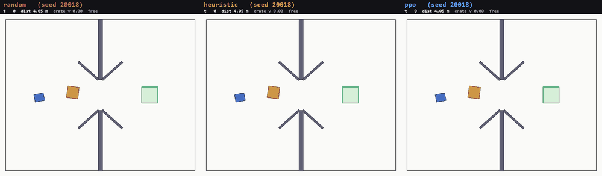

# FragileCargoDock-v0

一个用于**奖励工程（reward engineering）研究**的俯视 2D 连续控制环境：控制一辆仓库小车，把一个可自由运动的**易碎货箱**推过隔墙缺口，低速、低冲击地精确送入泊位。

本环境是为 CREATE（外层奖励工程智能体 + 内层 RL 智能体）这类"自动搜索奖励函数"的研究设计的测试任务 —— 它的规模刻意卡在 `LunarLander-v3`（单刚体、离散动作）与 `BipedalWalker-v3`（多关节协调）之间：**恰好一个耦合子系统（小车↔货箱接触）+ 一条分阶段目标链（接近 → 穿过缺口 → 对准 → 稳定保持）**，既足够难，又能让奖励设计的缺陷产生**可解释、可诊断**的异常行为。

---

## 1. 任务

固定仓库（16 × 8 m）被一面带缺口的隔墙分成两半，缺口两侧有角度导流挡板。小车和货箱从近侧随机位置出发，泊位在远侧。

- 小车**没有刹车、没有夹爪**，只能靠车头推力顶住货箱推动它。
- 货箱只靠地面阻尼减速，所以小车**无法从后方给货箱刹车**。
- 因此"一路推到泊位"永远无法满足低速判据 —— 策略必须学会**提前松手，让货箱靠阻尼滑入泊位**。这个精度-时机耦合是本环境的核心难点。

### 空间与动作

| 项 | 值 |
|---|---|
| 观测 | `Box(19,)`，所有分量裁剪到 `[-2, 2]` |
| 动作 | `Box(2,)`，`[-1, 1]`：`drive`（沿车头方向推力，最大 34 N）、`steer`（转向力矩，最大 4.5 N·m） |
| 回合 | 400 步（物理步长 1/120 s，每环境步 4 个子步，即 dt = 1/30 s ≈ 13.3 s） |
| 世界 | 顶视、零重力，地面摩擦用线/角阻尼模拟；Box2D 2.3 |

### 观测语义（19 维）

| 索引 | 名称 | 含义 |
|---:|---|---|
| 0 | `cart_x` | 小车 x / 5.0 |
| 1 | `cart_y` | 小车 y / 4.0 |
| 2, 3 | `cart_cos/sin_heading` | 小车朝向 |
| 4 | `cart_forward_speed` | 车体前向速度 / 3.0 (m/s) |
| 5 | `cart_yaw_rate` | 角速度 / 8.0 (rad/s) |
| 6, 7 | `crate_rel_x/y_body` | 货箱相对小车的位置（**车体坐标系**）/ 3.0 (m) |
| 8, 9 | `crate_vx/vy` | 货箱世界系速度 / 3.0 (m/s) |
| 10, 11 | `crate_cos/sin_heading` | 货箱朝向 |
| 12, 13 | `crate_to_dock_x/y` | 货箱到泊位中心的带符号偏移 |
| 14 | `cart_crate_contact` | 是否接触（0/1） |
| 15–17 | `sensor_front/left/right` | 前方/左/右静态障碍近距离传感器，`[0,1]`，0 = 无障碍 |
| 18 | `time_fraction` | 已消耗时间比例 |

> 距离没有直接给出，但**可从观测精确还原**。例如货箱世界坐标 = 小车位置 + 车体坐标系旋转 `(obs[6]*3.0, obs[7]*3.0)`。

### 终止与成功

**成功**（`terminated=True`，一次性 +300）——以下条件**连续保持 10 步**：
- 货箱**完全**位于泊位矩形内（泊位 0.84 × 0.84 m = 货箱的 1.4 倍，即 ±0.12 m 容差）
- 朝向误差 < 30°
- 货箱速度 < 0.05 m/s

**失败**（`terminated=True`，−100）：
- 货箱或小车中心离开仓库地面
- 货箱遭受 ≥ 3 次硬冲击（单步车-箱接触峰值法向冲量 > 5.0 N·s）

**超时**：`truncated=True`（不算成功）。

### `info` 诊断字段

`is_success`、`cargo_goal_distance`、`cargo_angle_error`、`cargo_speed`、`robot_cargo_distance`、`contact_impulse`、`hard_collision_count`、`stagnation_steps`、`action_energy`、`component_returns`、`official_reward_terms`、`termination_reason`、`cargo_inside_dock`、`stable_steps`、`dock_entered`、`elapsed_steps`、`time_fraction`。

其中 `official_reward_terms` / `component_returns` 是**官方奖励的分项**，在 CREATE 实验中应被 mask 掉、禁止被生成的奖励函数读取。

---

## 2. 为什么它适合奖励工程研究

环境会自然产生下列**奖励黑客**行为，每一种都有对应的可观测诊断信号：

| 奖励设计缺陷 | 学到的异常行为 | CREATE 诊断信号 |
|---|---|---|
| 接近货箱奖励过强 | 靠近后不推动 | 车-箱距离小，货箱进度为零 |
| **接触奖励过强** | **反复撞击 / 赖在货箱上** | **接触率与冲量峰值异常高，进度停滞** |
| 距离泊位奖励过强 | 猛撞货箱追求短期进度 | 距离快速下降，但碰撞与最终失败增加 |
| 朝向奖励过强 | 原地反复旋转货箱 | 角度改善但位置无进展 |
| 动作代价过强 | 停在起点 | 动作幅值接近零 |
| 每步位于泊位都奖励 | 在泊位边缘抖动刷分 | 泊位占用高但 `stable_steps` 不足 |
| **缺少低速约束** | **高速冲入后弹出** | **首次进入成功，但连续保持失败** |

最后两条加粗项是**本环境独有**的诊断价值：因为小车无法给货箱刹车，任何"推到终点才松手"的奖励设计都会稳定失败。

### 官方奖励（`OFFICIAL_W`，对奖励设计 LLM 隐藏）

| 分量 | 权重 | 说明 |
|---|---|---|
| `approach_cargo` | +1.0 / m | 车→箱距离缩短（**势函数塑形**，积分有界、无法刷分） |
| `progress` | +1.0 / m | 箱→泊位距离缩短（同为势函数塑形） |
| `dock_enter` | +5.0 | 首次完全进入泊位的一次性奖励 |
| `roughness` | −0.02 / (N·s) | 接触冲量比例惩罚（"轻拿轻放"） |
| `action_cost` | −0.0005 | 动作平方和 |
| `time_cost` | −0.002 / 步 | 时间成本 |
| `hard_hit` | −0.5 | 单步硬冲击 |
| `success` / `failure` | +300 / −100 | 终局 |

因此原生回报 ≈ `10 + 300 × 投递率`。

---

## 3. 基线结果

20 回合，固定种子 10000–10019，确定性动作：

| 策略 | 平均原生回报 | 成功率 | 入库率 | 平均步数 |
|---|---:|---:|---:|---:|
| 随机策略 | −1.14 | 0 % | 0 % | 400 |
| 手写推箱控制器 | 158.41 | 50 % | 90 % | 373 |
| **PPO（原生奖励，已收敛）** | **299.65** | **96.8 %** | 97 % | ~176 |

PPO 收敛结果来自 4 个 seed，各自 100 个**全新种子**回合（20000+）的池化统计：

| seed | 成功率 | 平均回报 | 标准差 |
|---|---:|---:|---:|
| 0 | 100 % | 309.65 | 0.35 |
| 1 | 97 % | 300.29 | 52.41 |
| 2 | 97 % | 300.58 | 52.10 |
| 3 | 93 % | 288.08 | 78.62 |
| **池化 400 回合** | **96.8 %** | **299.65** | — |

### 训练成果（渲染回放）



同一 episode 种子下的并排回放：

| seed | 随机策略 | 手写启发式 | 训练后 PPO |
|---|---|---|---|
| 20000 | 失败（400 步超时，距泊位 4.50 m） | 失败（400 步超时，0.31 m） | **成功，158 步，0.065 m** |
| 20018 | 失败（400 步超时，4.06 m） | 成功，314 步 | **成功，148 步，0.020 m** |

30 个种子上的成功率：**PPO 29/30，启发式 7/30**。

值得注意：不少启发式"失败"的回合终点距泊位其实只有 0.06–0.09 m（**货箱已经进入泊位**），
但没能满足"连续 10 步、速度 < 0.05 m/s"的保持条件 —— 这正是
「缺少低速约束 → 高速冲入后弹出」那一类奖励缺陷的实测表现。

### 奖励搜索实验

在本环境上做过一次 **CREATE vs EUREKA-style 种群搜索**的同预算对照实验
（同为 `deepseek-flash`、同 3000 万步、官方奖励对两者均隐藏）。
完整结果与报告见 **[`experiments/README.md`](experiments/README.md)**。

结论摘要：两个方法都**没有解出任务**（各 20 个评估回合 0 次成功入库，最优分数 +4.86 vs +5.13），
但 CREATE 的结构化诊断做出了可核对的结构修复；详见报告。

视频产物（`runs/env_007/videos/`）：

| 文件 | 内容 |
|---|---|
| `comparison_seed{20000,20018}.mp4` | 三宫格并排对比（主展示） |
| `comparison_seed{20000,20018}.gif` | GIF 预览版（前 6 秒、缩放） |
| `ppo_seed*.mp4` / `heuristic_seed*.mp4` / `random_seed*.mp4` | 各策略单独回放 |
| `comparison_seed*_final.png` | 末帧静图 |
| `render_results.json` | 每个回放的回报/步数/结束原因 |

回放 HUD 实时显示步数、货箱到泊位距离、货箱速度与接触状态，结束时定格显示结果。

---

## 4. 后续研究：从奖励搜索失败到「两处编辑」的定位

`experiments/` 记录的是**第一次** CREATE vs EUREKA 对照（3000 万步，两者都 0/20）。
在那之后，这个环境上的研究又走了很长一段，全部过程与数据都在本仓库里：

| 阶段 | 关键结论 | 文档 |
|---|---|---|
| 手写上界 | 只给观测的合约**能**表达可解的奖励：`probeD` 73.3 %、`probeE` 65.0 %、`probeC` 98.3 %，对照 `control_v1` 0 % | `runs/env_007/ABLATION_FINDINGS.md` |
| prompt 阶梯 | 泄漏源是论文 prompt **之上**加的脚手架规则：一次性事件 16/16 → 0–1/16，轻柔度 15/16 → 0–2/16 | `SESSION_STATE.md` §3e |
| 选择器死胡同 | 结构检查、轨迹排序、0.6 M/1.0 M 短训练档**全部**不能预测成功（后者 ρ = −0.486 / +0.371，且给 0 % 的对照背书） | `LADDER_FINDINGS.md` §5、`SESSION_STATE.md` §3f |
| 失败机制 | 能工作的臂把约 96 % 质量放在**真正被触达**的正向稀疏项；失败的 LLM 臂放在惩罚、可刷分的稠密项、或无处可放 | `LADDER_FINDINGS.md` §2 |
| **修复研究（主结果）** | 两处局部编辑——候选自己的 delta-progress 系数 ×50、把它的一次性终止收益改成成功谓词上的**稠密每步收益**——把两个独立候选各自从 **0/60** 提到 **23/60 = 38.3 %**（一个种子达 43/60 = 71.7 %） | `runs/env_007/REPAIR_TEST_FINDINGS.md` |
| 证据通道 | 管线自己的反思（已确认含决定性证据）vs 打乱表格的 sham：**real 0/8、sham 1/8** → 瓶颈是算子，不是证据 | `runs/env_007/REPAIR_LOOP_FINDINGS.md` |
| 优势探针 | `A ≤ 0`（不作为最优）能解释整个「不动」家族，但 `A` **不能**当选选择器（AUPRC 0.413） | `runs/env_007/ADVANTAGE_PROBE_FINDINGS.md` |
| v7 prompt | 删掉「禁止在成功状态上每步给分」这条错误禁令后：每步流 8/8、`A > 0` 4/8、首个入坞的未编辑 LLM 候选（`dock_entered` 0.18），但诚实命中只有 **1/8、3/60** | `runs/env_007/V7_PROMPT_PREREGISTRATION.md` |
| 尺度与种子 | 系数轴**非单调**（×75 崩、×100 好、×200 崩）：×100 三个种子 {31, 43, **0**}，某个种子入坞 0.95 却 0/60 → **停稳**才是绑定且高方差的一步 | `SESSION_STATE.md` §5.7–§5.8、`runs/env_007/RIDGE_WIDTH_PREREGISTRATION.md` |
| 九个引导消融 | 越界悬崖、额外轻柔度、接近度奖励、「又近又慢」漏斗等九个单轴「专家」编辑**全部 0/60**（对照同块 16/60） | `runs/env_007/{OVERSHOOT,APPROACH}_ABLATION_PREREGISTRATION.md` |
| 尚未运行 | 山脊恢复算子测试（已知失败的偏离候选 → 算子能否诊断回正轨） | `runs/env_007/RIDGE_RECOVERY_PREREGISTRATION.md` |

**完整阅读索引（含每个阶段的协议、数字与产物位置）：[`runs/env_007/RESEARCH_LOG.md`](runs/env_007/RESEARCH_LOG.md)。**

补充说明：本仓库现在也包含 CREATE / EUREKA 两个搜索驱动（`pipeline/`）、PPO harness（`training/`）、
prompt 谱系（`prompts/`）与全部实验配置（`configs/`）。它们在这里**不在包路径上**
（本仓库 `custom_envs/` 是扁平模块），要真正重跑搜索需要按主仓库的目录布局放置；
`run_fragilecargo_baseline.py` 与全部免训练诊断脚本（`analyze_terminal_dominance.py` 等）在本仓库可直接运行。

---
## 5. 2026-09-21 那一轮：把「缺什么成分」问到了底

完整过程与原始数据在 `runs/env_007/`，索引见 [`runs/env_007/RESEARCH_LOG.md`](runs/env_007/RESEARCH_LOG.md)；给外部评审的完整状态文档（含三份补充）在
[`docs/external_reviews/fragilecargo_status_and_open_problems.md`](docs/external_reviews/fragilecargo_status_and_open_problems.md)。

| 实验 | 预注册 + 结果 | 结论 |
|---|---|---|
| **单变量隔离**：`control_v1` vs `control_v1` + 一个仅用观测的接近速度惩罚 | `runs/env_007/CLOSE_SPEED_ISOLATION_{PREREGISTRATION,FINDINGS}.md` | 机制干净：`C0` 入坞率 0.90 却**平均连一步都停不住**（最大连续停稳步数 0.83），加那一项后 5-8 步、seed 0 从 0/60 到 46/60。**但 4 种子配对检验判 N（null）**（95 % 区间 [−79.5, +53.0]，p = 0.55）——单种子对比是一次抽样 |
| **v8 prompt**：删掉「停稳期每步收益 vs 完成状态其余组件必须为 0」的自相矛盾 | `runs/env_007/V8_PROMPT_PREREGISTRATION.md`、`prompts/eureka_01_initial_reward_v8.md` | 形式修好了：7/8 候选不再关掉停稳收益；`cand_01` 的推进项每回合 **14.04**（v7 是 2747，修好 400 倍）、停稳项成为主导 → **4/60、入坞 0.70**（v7 最好 3/60、0.18）——**但仍停不住**（2.42 步） |
| **系数强度假设** | `runs/env_007/CALIBRATION_TEST_PREREGISTRATION.md` | **被自己的实验否掉**：把 gentleness 系数放大 15× / 50×，入坞率 0.70 → **0.00**，策略连动都不动 |
| **种子复制**（每臂 4 个 training seed，同一块） | `runs/env_007/SEED_REPLICATION_{PREREGISTRATION,FINDINGS}.md` | **手写奖励 `control_v1` 在 4 个种子上是 0 / 43 / 54 / 35 / 60。** 重读既有 rung 数据后，`probeC`（98.3 % 的臂）在 0.6M 是 25/0/0、`probeD`（73.3 %）在 1.0M 是 0/31/1 —— **LLM 臂与手写臂的成功率分布是重叠的** |
| **种子 × 预算** | 同上 §2c | **1.2M 无法预测 3M**：`C1` 的好种子 45/60（1.2M）→ **3/60**（3M）；3M 下四个格子里三个是 0–3/60、只有一个是 51/60，而两臂入坞率都是 0.88–0.92 |

**三条可执行的结论：**

1. **不存在便宜的筛选法**：1.2M 看不出 3M 的结果。选择必须在你要报告的预算上、以 **>= 3 个 training seed** 为单位，报分布而不是单个数字。
2. **项目里每一个 3M 单种子数字都是抽样**（本仓库 `experiments/` 里两个方法的 0/20 也一样）。**要修的是 pipeline 的选择指标**（当前用单种子 `mean_eval_reward` 排序），不是 prompt、不是生成器、不是证据通道。
3. **唯一与结果同向的信号是策略行为统计量**，不是奖励函数的属性：训练中停稳项每回合实际收益（19→0/60、68→0/60、97→26、140→46、170→48、272→51，一处反序 380→13）。这解释了为什么五个**免训练**探针全部失败——它们测的是奖励函数，而这个测的是**策略轨迹**。

---


## 6. 标定结论（重要）

完整报告见 [`runs/env_007/CALIBRATION.md`](runs/env_007/CALIBRATION.md)。

### 关键超参

| 配置（120 万步） | 成功率 | 平均回报 |
|---|---:|---:|
| γ = 0.99 | 0 % | 6.2 |
| γ = 0.995 | 40 %（10%↔60% 震荡） | 126.1 |
| γ = 0.999 | 0 % | −0.9 |
| **γ = 0.999 + `normalize_reward`** | **80 %** | **250.0** |

**`normalize_reward` 是决定性开关。** 400 步回合下稀疏的 +300 终局奖励在 t=0 被 γ=0.99 折现到仅 ≈ 5.4，未归一化时值函数发散（实测 `value_loss` 105 → 167，`explained_variance` 崩到 0.06）。高 γ 单独使用不仅无效，反而更差。

### 收敛步数

用 4 个 seed × 300 万步、每 25 万步固定种子评估测得。各 seed 首次进入并保持 ≥90% 成功率的步数：

| seed | 收敛于 |
|---|---:|
| 3 | 75 万步 |
| 0 / 2 | 125 万步 |
| 1 | 175 万步 |

**推荐训练预算：250 万步**（全部 seed 已 ≥90%）；**300 万步**留余量。低于 200 万步时 seed 间差异仍很大（0%–100%）。

### 推荐设置

```yaml
training:
  n_envs: 6
  total_timesteps: 3000000
  gamma: 0.999
  normalize_reward: true
  ent_coef: 0.005
iteration:
  target_score: 250.0                 # ≈ 80% 投递率
  min_meaningful_improvement: 15.0    # 20 回合评估下多成功一次 = 15 分
```

**标准分数 ≈ 300**（收敛后的原生回报）。**建议的 `target_score = 250`** 对应约 80% 投递率：高于手写控制器的 50%（158），低于收敛上限（300），为搜索留有余量。

---

## 7. 快速开始

### 安装

在 Python 3.10 环境中：

```bash
pip install -r requirements.txt
```

实测通过的环境：Python 3.10.11 / gymnasium 1.3.0 / stable-baselines3 2.9.0 / torch 2.13.0 / numpy 2.2.6 / Box2D 2.3.10 / pygame 2.6.1。

### 运行

所有命令都在本仓库根目录执行（环境以相对路径注册）。

```bash
# 契约自检 + 参考策略（随机 / 手写控制器）
python run_fragilecargo_baseline.py --policies random,heuristic --episodes 20

# 完整 PPO 标定训练（约 3M 步）
python run_fragilecargo_baseline.py --policies ppo --total-timesteps 3000000 \
    --n-envs 6 --eval-every 250000 --gamma 0.999 --normalize-reward \
    --seed 0 --out-dir runs/env_007/ac3_s0

# 用已训练模型在全新种子上复评（不重新训练）
python run_fragilecargo_baseline.py --policies ppo --episodes 100 --eval-seed-offset 20000 \
    --load-model runs/env_007/ac3_s0/model.zip \
    --load-vecnormalize runs/env_007/ac3_s0/vecnormalize.pkl \
    --out-dir runs/env_007/confirm_s0

# 打印单回合控制轨迹，便于调试
python run_fragilecargo_baseline.py --trace

# 冒烟测试（20 万步 + 5 回合）
python run_fragilecargo_baseline.py --quick

# 渲染训练后模型的回放视频（MP4 + GIF + 静图，无需显示器）
python record_fragilecargo_policies.py --seeds 20000,20018 --keep-frames
```

`--policies` 可取 `random` / `heuristic` / `ppo` 的任意组合。全部 PPO 超参均可通过命令行覆盖（`--gamma --learning-rate --ent-coef --n-steps --batch-size --net-arch --activation --normalize-reward` 等）。

`--eval-every N` 会启用**训练中的固定种子周期评估**：每 N 步在固定种子集上跑确定性评估，同时记录平均原生回报**和任务成功率**（SB3 自带的 `EvalCallback` 只给回报），结果增量写入 `learning_curve.json`，因此长训练可以在跑的过程中监控。

---

## 8. 文件结构
```
.
├── README.md
├── requirements.txt
├── run_fragilecargo_baseline.py          # 基线程序 / 标定工具
├── record_fragilecargo_policies.py       # 回放渲染（MP4 / GIF / 静图）
├── analyze_terminal_dominance.py         # 结构探针检查（秒级）
├── trajectory_ranking_check.py           # 可达轨迹排序检查
├── advantage_scale_probe.py              # 每步优势 A（免训练诊断，非选择器）
├── check_settled_stream.py               # 「停稳状态上是否每步付钱」机械检查
├── probe_v7_shape.py                     # 在真实成功轨迹上分解逐候选收益形状
├── analyze_native_reward.py              # 原生奖励逐项分解（势函数 vs 全回路）
├── compare_shaping_scale.py              # 塑形 : 终止 比例的横向对比
├── pilot_generate_only.py                # 只生成不训练的 prompt A/B
├── {ladder,rung,mechanistic,v7}_*.py     # 选择器研究 / 读数 / 汇总
├── make_{repair,recipe,align_fix,overshoot,approach,ridge}_variants.py
│                                        # 生成各消融与修复变体（oracle 局部编辑）
├── run_repair_loop.py / repair_loop_analysis.py   # real vs sham 修复环路
├── custom_envs/
│   ├── __init__.py
│   ├── registration.py                   # 集中式环境注册（供入口 import）
│   └── fragile_cargo_dock_env.py         # 环境实现
├── envs/env_007/
│   ├── task_spec_anonymized{,_v2}.yaml   # 环境语义说明书（给奖励设计 LLM）
│   └── masked_step_source.py             # 脱敏 step 源码（官方奖励被 mask）
├── configs/                              # 全部实验配置（CREATE / EUREKA / 各 pilot / clip A-B）
├── prompts/                              # prompt 谱系 v1→v7 + EUREKA 编辑 + CREATE 各阶段
├── pipeline/                             # CREATE 与 EUREKA 两个搜索驱动
├── training/                             # PPO harness（RewardOverrideWrapper + SB3 入口）
├── llm_clients/                          # 模型客户端
├── SESSION_STATE.md / NEXT_SESSION.md / HANDOFF_QUESTIONS.md   # 研究状态与问题陈述
├── experiments/                          # CREATE vs EUREKA 首次对照（结果 + 报告）
│   ├── README.md                         #   实验报告
│   ├── create_rounds.csv                 #   逐轮分数 / 组件份额 / 激活率
│   └── eureka_generations.csv            #   逐候选分数 / 血缘
└── runs/env_007/
    ├── RESEARCH_LOG.md                   # baseline → v7 全过程索引（先读这个）
    ├── CALIBRATION.md                    # 完整标定报告
    ├── *_FINDINGS.md / *_PREREGISTRATION.md   # 每个阶段的预注册 + 结果
    ├── baseline/ · calib_g99|g995|g999|g999n/ · ac3_s0..s3/ · confirm_s0..s3/
    ├── prompt_ladder{,_v7}/ · prompt_ab/ · terminal_rule_pilot*/   # prompt 阶梯与 pilot
    ├── ablation_probe/ · control_obs_only/ · passthrough_probe/     # 手写探针与诊断
    ├── repair_test/ · align_fix_test/ · recipe_replication/ · repair_loop/   # 修复研究
    ├── overshoot_ablation/ · approach_ablation/ · ridge_width/ · rung_06m/ · rung_10m/
    ├── ladder_train/ · v4_train/ · train_queue.ps1                 # 训练队列与运行记录
    ├── fragilecargo_create{,_v2}/ · fragilecargo_eureka{,_v2,_v5}/  # 搜索过程的逐轮产物
    └── videos/ · reward_search_videos/ · overshoot_videos/          # 渲染静图
```
## 9. 实现备忘（踩过的坑）

1. **pybox2d 的刚体身份比较**。`fixture.body` 每次访问都返回**不同的 Python 包装对象**，所以 `a is body` 恒为 `False`（`a == body` 才比较底层指针）。最初用 `is` 判断接触对，导致 `contact_impulse` 恒为 0。现改为给两个刚体打 `userData` 标签来识别。
2. **导流挡板是必需的**。货箱带角度时外形包络会超过缺口净宽，卡在缺口边沿，把任务变成"解卡谜题"而非"精确入库"。缺口两侧加 41° 导流挡板后解决。
3. **原生奖励的两个缺陷**（标定过程中实测发现并修正，详见 CALIBRATION.md 第 3 节）：
   - 原 `gentle_contact = +0.02/步` 的接触奖励造成**陷阱局部最优**：货箱顶到隔墙推不动后，小车"赖着不动"每步拿 0.02，250 步 ≈ +5，正好凑出恒为 **+6.5** 的卡死平台（4 个 seed 中 2 个中招）。改为冲量比例的**粗糙度惩罚**后陷阱消失。
   - 但修掉后探索崩了（4 个 seed 在 225 万步内 3 个完全不动），暴露出缺少引导信号。补上势函数形式的 `approach_cargo` 后，同样 75 万步预算下成功率从 **0/0/0/0 %** 变为 **90/30/80/100 %**。
4. **环境是确定性的**：固定 seed + 固定动作序列下两次回报逐位相同；所有随机化走 `self.np_random`（不是全局 `random`），保证 `SubprocVecEnv` 子进程间可复现。
5. **渲染必须应用刚体旋转**。最初 `render()` 用 `shape.vertices[2]` 取半宽半高再画**轴对齐矩形**，把 41° 斜置的导流挡板画成了水平横条，几何完全失真。现在改为取 fixture 真实顶点、按 `body.angle` 旋转后再画多边形。另外 pybox2d 的 `shape.vertices` 返回的是**普通元组** `(x, y)` 而非 `b2Vec2`，`v.x` 会抛 `AttributeError`。
6. **视频编码**：环境里默认只有 `imageio` 没有编码器，需额外装 `imageio-ffmpeg`（自带 ffmpeg 二进制）才能写 MP4；渲染用 `SDL_VIDEODRIVER=dummy` 即可无显示器运行。

---

## 10. 与 CREATE 主管线的接入

本仓库只包含环境与基线。若要接入 CREATE 迭代奖励搜索（`expert-reward-agent` 项目），需要：

1. 把 `custom_envs/`、`envs/env_007/`、`configs/env007_fragilecargo_eureka.yaml` 按相同相对路径放入主管线仓库根目录。
2. 在两个会创建环境的入口（`training/train_sb3_wrapper.py` 与 `pipeline/run_iterative_experiment.py`）import `custom_envs.registration`，让 `SubprocVecEnv` 子进程也能看到注册表。
3. `configs/env007_fragilecargo_eureka.yaml` 里引用了 `prompts/01_environment_analyzer_prompt.md` 等主管线文件，单独放在本仓库无法直接跑 CREATE。

`task_spec_anonymized.yaml` 中的 `interface_constraints.allowed_info_fields: []` 表示**生成的奖励函数只允许使用观测与动作**，`info` 里的官方奖励分项全部禁止读取。

---

## 11. 来源与致谢

本环境为 [CREATE / expert-reward-agent](https://github.com/Nicole-ying/expert-reward-agent) 项目的奖励工程研究而构建，用于验证"外层奖励工程智能体观察训练证据 → 反思 → 语义局部化地编辑奖励程序"这一循环。

环境实现（`custom_envs/fragile_cargo_dock_env.py`）为原创，基于 Box2D 与 Gymnasium API。
